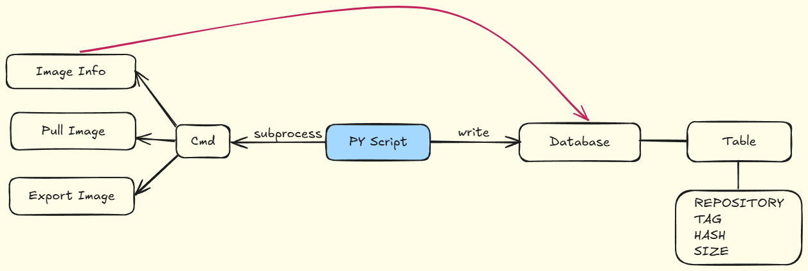

# Save-Docker-Image
Synchronize the local and database images, and export and save the local image


**Usage**
You should have a mysql database and create a table with SQL command:

 ```sql
CREATE TABLE IF NOT EXISTS images (
    id INT PRIMARY KEY AUTO_INCREMENT,
    repository VARCHAR(255) NOT NULL,
    tag VARCHAR(100) NOT NULL,
    hash VARCHAR(100) NOT NULL,
    size VARCHAR(50) NOT NULL
);
  ```

Create a .env file like below


After install all requirements, you can import saveImage and use method.

---

**Architecture**

